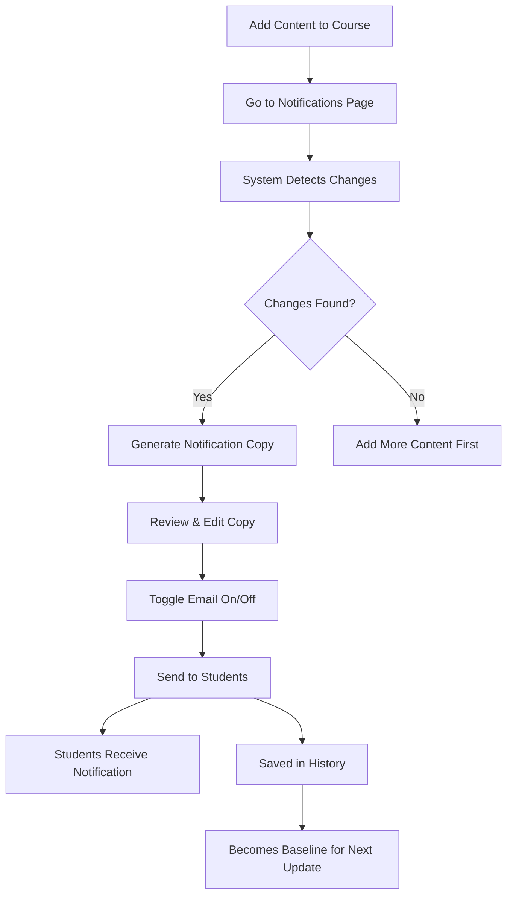

# 🔔 Course Update Notifications System

## Overview

Automatically notify your students when you add new content to courses. The system uses AI to generate engaging notification copy and tracks what's changed since your last notification.

---

## ✨ Features

### 1. **Automatic Change Detection**
- Tracks new modules, lessons, and chapters
- Compares current state vs. last notification
- Identifies specific new content added

### 2. **AI-Powered Copy Generation**
- Analyzes course updates
- Creates compelling notification text
- Generates email subject lines
- Writes preview text

### 3. **Multi-Channel Delivery**
- In-app notifications (appears in header bell icon)
- Email notifications (optional)
- Sent to all enrolled students

### 4. **Notification History**
- Complete history of all sent notifications
- Shows what changed in each update
- Tracks recipient counts
- View past notification content

---

## 🚀 How to Use

### Step 1: Add New Content to Your Course

```
1. Go to your course in dashboard
2. Click "Edit Course"
3. Add new modules, lessons, or chapters
4. Save your changes
```

### Step 2: Access Notifications

**From Products List:**
```
1. Find your course
2. Click the ⋮ (three dots) menu
3. Select "Send Update" 🔔
```

**Direct URL:**
```
/store/[storeId]/course/[courseId]/notifications
```

### Step 3: Review Changes

The system will show you:
- ✅ How many new modules/lessons/chapters
- ✅ List of new module titles
- ✅ When you last sent a notification
- ✅ Current enrolled student count

### Step 4: Generate Notification

```
1. Click "Generate Notification with AI"
2. Wait 10-15 seconds
3. AI analyzes all changes
4. Creates compelling copy
```

### Step 5: Review & Customize

The AI generates:
- **Title**: "🎉 New Content Just Dropped in [Course Name]!"
- **Message**: Engaging update with specifics
- **Email Subject**: Compelling subject line
- **Email Preview**: Inbox preview text

**Edit if needed:**
- Click "Edit" to customize any section
- Make it match your brand voice
- Add personal touches

### Step 6: Send to Students

```
1. Toggle email sending on/off
2. Review final copy
3. Click "Send Notification"
4. Confirm sending
5. ✅ Done! Students notified
```

---

## 📊 How It Works

### Architecture

```
Course Update
    ↓
Change Detection
(Compare current vs last notification)
    ↓
AI Analysis
(Generate compelling copy)
    ↓
Multi-Channel Send
├── In-App Notification (All students)
└── Email (Optional)
    ↓
History Tracking
(Record for future reference)
```

### Change Detection Algorithm

```typescript
Current State - Last Notification State = Changes

Example:
Current: 5 modules, 20 lessons, 60 chapters
Last:    3 modules, 15 lessons, 45 chapters
Changes: +2 modules, +5 lessons, +15 chapters
```

### AI Copy Generation

The AI considers:
- Course title and category
- What content was added
- Module/lesson titles
- Teaching style and tone
- Target audience

Then creates:
- Exciting title
- Benefit-focused message
- Email subject (optimized for opens)
- Preview text (hooks readers)

---

## 💡 Best Practices

### When to Send Notifications

**✅ GOOD TIMES:**
- After adding a major module (3+ lessons)
- Completing a section you promised
- Adding highly-requested content
- Finishing the full course
- Seasonal/timely updates

**❌ AVOID:**
- After every tiny change
- More than once per week
- Before testing new content
- For minor corrections

### Recommended Frequency

- **Ideal**: Once every 1-2 weeks
- **Maximum**: Once per week
- **Minimum**: Once per month

### Writing Great Notifications

**Title:**
```
❌ Bad: "Course Update"
✅ Good: "🎉 3 New Mixing Modules Just Added!"
```

**Message:**
```
❌ Bad: "We added some content. Check it out."

✅ Good: "Exciting news! I just added 3 brand new modules covering 
advanced compression techniques you've been asking for. You'll learn 
parallel compression, sidechain tricks, and how to add punch without 
losing dynamics. Jump in now to level up your mixing game! 🚀"
```

### Email Best Practices

1. **Subject Lines:**
   - Keep under 50 characters
   - Use emojis sparingly (1 max)
   - Create curiosity
   - Promise value

2. **Preview Text:**
   - Expands on subject
   - Mentions specific new content
   - Creates urgency

---

## 📈 Analytics & Insights

### Stats Dashboard

Track your notification performance:
- **Total Sent**: Number of notifications sent
- **Total Reach**: Sum of all recipients
- **Avg. Recipients**: Average students per notification
- **Days Since Last**: How long since last update

### History View

For each notification, see:
- When it was sent
- What changed
- How many received it
- Full notification text
- Whether email was sent

### Use Cases

**Analyzing Engagement:**
- Compare recipient counts over time
- See which updates got most attention
- Identify notification frequency sweet spot

**Planning Future Updates:**
- Review past notification schedule
- Avoid over-notifying
- Time updates strategically

---

## 🎯 Example Workflow

### Scenario: Added New Advanced Module

**1. Creator adds content:**
```
Old Course: 3 modules
New Course: 4 modules (added "Advanced Vocal Processing")
```

**2. System detects:**
```
Changes: +1 module, +4 lessons, +12 chapters
New Module: "Advanced Vocal Processing"
```

**3. AI generates:**
```
Title: "🎙️ Master Vocal Processing—New Advanced Module Inside!"

Message: "Great news! I just released a brand new advanced module 
on vocal processing. You'll learn de-essing, multiband compression, 
parallel saturation, and how to get that radio-ready vocal sound. 
Perfect timing if you're ready to take your vocal mixes to the next 
level. Check it out now!"

Email Subject: "New vocal processing masterclass inside 🎙️"
Email Preview: "Learn de-essing, compression, and how to get 
radio-ready vocals..."
```

**4. Creator reviews:**
- Reads the copy
- Makes minor edits
- Checks email preview
- Confirms

**5. Students receive:**
- ✅ In-app notification (bell icon shows badge)
- ✅ Email (if enabled)
- ✅ Click to view new content

**6. Tracking:**
- Recorded in history
- Shows 156 students notified
- Becomes baseline for next update

---

## 🔧 Technical Details

### Database Schema

**courseNotifications table:**
```typescript
{
  courseId: Id<"courses">,
  creatorId: string,
  title: string,
  message: string,
  changes: {
    newModules: number,
    newLessons: number,
    newChapters: number,
    updatedContent: boolean,
    modulesList: string[]
  },
  courseSnapshot: {
    totalModules: number,
    totalLessons: number,
    totalChapters: number
  },
  sentAt: number,
  recipientCount: number,
  emailSent: boolean
}
```

### API Functions

**Queries:**
- `detectCourseChanges` - Compares current vs last notification
- `getCourseNotificationHistory` - Gets all past notifications
- `getCourseNotificationStats` - Gets aggregate stats

**Actions:**
- `generateNotificationCopy` - AI generates notification text

**Mutations:**
- `sendCourseUpdateNotification` - Sends to all students

---

## 📧 Email Integration

### Current Status

**In-App Notifications**: ✅ Fully working
**Email Notifications**: 🔄 Foundation ready

### Email Setup

To enable email sending:

1. **Update `sendCourseUpdateEmails` in `courseNotifications.ts`:**

```typescript
export const sendCourseUpdateEmails = action({
  handler: async (ctx, args) => {
    const resend = new Resend(process.env.RESEND_API_KEY);
    
    for (const studentId of args.studentIds) {
      // Get student email
      const student = await ctx.runQuery(api.users.getUserFromClerk, {
        clerkId: studentId
      });
      
      if (student?.email) {
        await resend.emails.send({
          from: "updates@yourdomain.com",
          to: student.email,
          subject: args.emailSubject,
          html: `
            <h2>${args.emailSubject}</h2>
            <p>${args.emailBody}</p>
            <a href="${process.env.NEXT_PUBLIC_APP_URL}/courses/${args.courseSlug}">
              View Course
            </a>
          `
        });
      }
    }
    
    return null;
  },
});
```

2. **Set environment variables:**
```env
RESEND_API_KEY=re_...
NEXT_PUBLIC_APP_URL=https://yourdomain.com
```

---

## 🎨 UI Components

### Notifications Page

**Location**: `/store/[storeId]/course/[courseId]/notifications`

**Sections:**
1. **Stats Overview** - Quick metrics
2. **Detected Changes** - What's new
3. **Generate & Send** - AI copy generation
4. **Notification History** - Past updates
5. **Course Stats** - Current totals

### Access Points

**From Products List:**
- Course dropdown menu → "Send Update"

**From Course Editor:**
- Add "Notify Students" button (future enhancement)

---

## 🔐 Security & Permissions

### Validation

- ✅ Only course owner can send notifications
- ✅ Only enrolled students receive notifications
- ✅ User ID verification on all operations
- ✅ Course ownership checked

### Privacy

- Students only see their own notifications
- Creators only see their course notification history
- No cross-course notification access

---

## 💰 Costs

- **AI Generation**: ~$0.01 per notification
- **Email Sending**: ~$0.001 per email (via Resend)
- **Total per notification**: ~$0.02-0.05 (depending on student count)

**Example:**
- Course with 100 students
- Send 1 update notification
- Cost: ~$0.01 (AI) + $0.10 (emails) = **$0.11 total**

---

## 🎯 Optimization Tips

### Maximize Engagement

1. **Timing:**
   - Send on Tuesday-Thursday
   - Avoid weekends
   - Consider time zones

2. **Content:**
   - Be specific about what's new
   - Highlight benefits, not features
   - Use emojis sparingly (1-2 max)
   - Include clear call-to-action

3. **Frequency:**
   - Don't over-notify
   - Batch updates when possible
   - Major updates only

### A/B Testing

Track which notifications perform best:
- Short vs. long messages
- Emoji usage
- Different tones
- Subject line styles

---

## 🔮 Future Enhancements

### Phase 2 (Planned)

- 📊 **Open/click tracking** for emails
- 🎯 **Segmented notifications** (by progress level)
- ⏰ **Scheduled notifications** (send later)
- 📱 **Push notifications** (mobile app)
- 🧪 **A/B testing** built-in
- 📈 **Engagement analytics**

### Phase 3 (Ideas)

- Auto-notifications when content added
- Drip campaign for new enrollments
- Re-engagement for inactive students
- Graduation/completion celebrations

---

## 🐛 Troubleshooting

### "No changes detected"

**Cause**: No content added since last notification
**Solution**: Add new modules/lessons/chapters first

### "Course not found"

**Cause**: Invalid courseId or not owner
**Solution**: Verify you own the course and courseId is correct

### "Failed to send"

**Possible causes:**
- No enrolled students yet
- Course not saved properly
- Database connection issue

**Solution:**
- Check course has enrollments
- Verify course is saved
- Check Convex console

---

## 📚 Related Features

- **Course Analytics**: Track how updates affect engagement
- **Email Campaigns**: Broader marketing beyond updates
- **Landing Page Generator**: Create compelling course pages

---

## 🎓 Example Notifications

### Example 1: New Module

```
Title: "🎵 New Module: Advanced Drum Programming Techniques!"

Message: "Exciting news! I just released Module 5 covering advanced 
drum programming techniques. You'll learn swing & groove programming, 
humanization tricks, and genre-specific patterns. Perfect if you want 
to move beyond basic beats. Available now in the course!"

Email Subject: "New drum programming module added 🥁"
Email Preview: "Learn swing, humanization, and genre-specific drum patterns..."
```

### Example 2: Content Expansion

```
Title: "📚 20+ New Lessons Added Across 3 Modules!"

Message: "Huge update! I just expanded the course with 20 new lessons 
covering the topics you've been asking for—vocal mixing, mastering prep, 
and creative effects. This is some of my best content yet. Dive in and 
level up your production skills today!"

Email Subject: "Your course just got 20 new lessons 🚀"
Email Preview: "Vocal mixing, mastering prep, creative effects—new content inside..."
```

### Example 3: Course Complete

```
Title: "🎉 Course Now Complete—All 10 Modules Released!"

Message: "It's official—the full course is now complete! All 10 modules, 
45 lessons, and 150+ chapters are live. Thank you for your patience. 
You now have everything you need to go from beginner to advanced. 
Time to finish strong! 💪"

Email Subject: "Full course unlocked—all modules now available 🎉"
Email Preview: "All 10 modules and 150+ chapters are now live. Let's finish this..."
```

---

## 📋 Quick Reference

### Navigation

| Action | Path |
|--------|------|
| Send Update | Products → Course Menu → "Send Update" |
| View History | `/store/[storeId]/course/[courseId]/notifications` |
| Edit Course | Products → Course Menu → "Edit Course" |

### Key Functions

| Function | Purpose |
|----------|---------|
| `detectCourseChanges` | Find what's new |
| `generateNotificationCopy` | AI copy generation |
| `sendCourseUpdateNotification` | Send to students |
| `getCourseNotificationHistory` | View past notifications |

---

## 🎬 Complete Workflow



---

## ✅ Checklist

Before sending your first notification:

- [ ] Course has enrolled students
- [ ] New content has been added
- [ ] Content is tested and working
- [ ] Reviewed AI-generated copy
- [ ] Customized to match your voice
- [ ] Decided on email sending
- [ ] Ready to notify students

---

## 🎁 Benefits

**For Creators:**
- ✅ Saves 20-30 minutes per update
- ✅ Professional copy every time
- ✅ Complete notification history
- ✅ Track student engagement
- ✅ Build course momentum

**For Students:**
- ✅ Never miss new content
- ✅ Stay engaged with course
- ✅ Timely, relevant updates
- ✅ Know what to check out next

---

## 🚦 Status

| Component | Status |
|-----------|--------|
| Schema | ✅ Complete |
| Change Detection | ✅ Complete |
| AI Copy Generator | ✅ Complete |
| Notification Sending | ✅ Complete |
| History Tracking | ✅ Complete |
| UI Dashboard | ✅ Complete |
| In-App Notifications | ✅ Complete |
| Email Integration | 🔄 Foundation Ready |

---

## 🎯 Next Steps

### Immediate

1. Test with a sample course
2. Add new content
3. Generate notification
4. Review AI copy
5. Send to test students

### Short-term

1. Implement email sending
2. Add notification badge counts
3. Track open/click rates
4. Add notification preferences

### Long-term

1. Auto-notify on publish
2. Scheduled notifications
3. Segmented audiences
4. A/B testing framework

---

**Built to keep your students engaged and coming back for more!** 🚀

