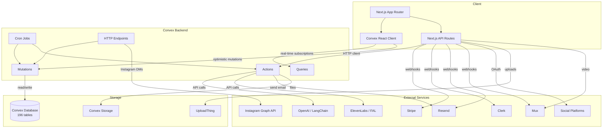

# System Architecture Overview

> **Last Updated:** 2026-02-19
> **Pass:** 1 — Foundation

---

## Table of Contents

- [1. High-Level Architecture](#1-high-level-architecture)
- [2. Architecture Pattern](#2-architecture-pattern)
- [3. Hosting & Deployment](#3-hosting--deployment)
- [4. Authentication System](#4-authentication-system)
- [5. Payment System](#5-payment-system)
- [6. Email Service](#6-email-service)
- [7. AI / LLM Integrations](#7-ai--llm-integrations)
- [8. Video & Media](#8-video--media)
- [9. File Storage](#9-file-storage)
- [10. Third-Party Services](#10-third-party-services)
- [11. Data Flow Diagram](#11-data-flow-diagram)
- [12. Cron Jobs & Background Processing](#12-cron-jobs--background-processing)

---

## 1. High-Level Architecture

PPR Academy is a full-stack **music production education and creator marketplace** platform. The architecture follows a modern JAMstack-influenced pattern with a real-time backend:

```
┌──────────────────────────────────────────────────────────┐
│                      CLIENT TIER                          │
│  Next.js 15 App Router (React 19, TypeScript, Turbopack) │
│  ┌──────────┐ ┌──────────┐ ┌──────────┐ ┌────────────┐  │
│  │ Dashboard │ │Marketplace│ │  Admin   │ │ Creator    │  │
│  │ (learn/  │ │ (public) │ │  Panel   │ │ Storefronts│  │
│  │  create) │ │          │ │          │ │ (dynamic)  │  │
│  └──────────┘ └──────────┘ └──────────┘ └────────────┘  │
└──────────────────────┬───────────────────────────────────┘
                       │ Convex Client SDK (real-time subscriptions)
                       │ Next.js API Routes (server-side)
┌──────────────────────┴───────────────────────────────────┐
│                    BACKEND TIER                            │
│              Convex (Real-time BaaS)                      │
│  ┌──────────┐ ┌──────────┐ ┌──────────┐ ┌────────────┐  │
│  │ Queries  │ │Mutations │ │ Actions  │ │  Crons     │  │
│  │ (reads)  │ │ (writes) │ │ (side fx)│ │  (8 jobs)  │  │
│  └──────────┘ └──────────┘ └──────────┘ └────────────┘  │
│  ┌──────────┐ ┌──────────┐ ┌──────────┐                  │
│  │ HTTP     │ │ Workflows│ │ File     │                  │
│  │ Endpoints│ │ Engine   │ │ Storage  │                  │
│  └──────────┘ └──────────┘ └──────────┘                  │
│  196 database tables │ 1,887+ exported functions          │
└──────────────────────┬───────────────────────────────────┘
                       │
┌──────────────────────┴───────────────────────────────────┐
│                  EXTERNAL SERVICES                        │
│  Clerk │ Stripe │ Resend │ OpenAI │ Mux │ ElevenLabs    │
│  FAL   │ Sentry │ Upstash│ Tavily │ Discord │ Instagram │
│  TikTok│ Twitter│ Spotify│ YouTube │ Apple Music        │
└──────────────────────────────────────────────────────────┘
```

## 2. Architecture Pattern

| Layer | Technology | Purpose |
|-------|-----------|---------|
| **Frontend** | Next.js 15 (App Router) + React 19 | SSR, routing, UI rendering |
| **Styling** | Tailwind CSS 3.4 + shadcn/ui (Radix) | Component design system |
| **Backend** | Convex 1.31 | Real-time database, server functions, file storage |
| **Auth** | Clerk 6.21 | User authentication, session management |
| **Payments** | Stripe 18.5 | Checkout, Connect, subscriptions, webhooks |
| **Email** | Resend | Transactional + marketing email |
| **AI** | OpenAI 5.3 + LangChain 0.3 | Content generation, AI assistants |
| **Video** | Mux + Remotion 4.0 | Video hosting + programmatic video generation |
| **Error Tracking** | Sentry | Error monitoring, performance tracing |

### Key Architectural Decisions

- **Convex over traditional REST/GraphQL**: Provides real-time subscriptions out of the box, eliminates need for separate WebSocket layer, and handles optimistic updates automatically.
- **Next.js API Routes for external integrations**: Webhook handlers, OAuth callbacks, and Stripe sessions run as Next.js serverless functions since they require raw HTTP access that Convex HTTP endpoints don't fully support.
- **Dual data path**: Client components subscribe to Convex queries directly (real-time). Server components and API routes call Convex via the HTTP client.
- **Multi-tenant via stores**: Each creator gets a `store` record with its own products, email config, analytics, and optional custom domain.

## 3. Hosting & Deployment

| Component | Host | Details |
|-----------|------|---------|
| **Next.js frontend** | Vercel | Standalone output mode, automatic deployments |
| **Convex backend** | Convex Cloud | Managed service, two deployments: `dev:fastidious-snake-859` and `prod:impartial-viper-898` |
| **File storage** | Convex Storage + UploadThing | Audio, PDFs, images stored in Convex; large uploads via UploadThing |
| **CDN / Images** | Vercel Edge + Convex CDN | Image optimization via Next.js Image component |
| **DNS / Domains** | Vercel (primary) + custom domains | Creator storefronts support custom domains via middleware routing |
| **Desktop app** | Electron (in `/desktop/`) | Separate desktop application for sample management |

## 4. Authentication System

**Provider:** Clerk v6.21

- **Frontend**: `@clerk/nextjs` with `ClerkProvider` wrapping the app
- **Middleware**: `middleware.ts` protects `/dashboard/*`, `/library/*`, `/onboarding/*`, `/profile/*`, and API routes
- **Backend**: Convex functions use `ctx.auth.getUserIdentity()` to get the Clerk identity
- **User sync**: Clerk webhook (`/api/webhooks/clerk`) syncs user data to Convex `users` table
- **ID mapping**: Clerk `clerkId` (string) is the primary user identifier across the system; Convex `_id` is used for document references

### Auth Helper Functions (`lib/auth-helpers.ts`)

| Function | Purpose |
|----------|---------|
| `requireAuth()` | Get authenticated user or throw 401 |
| `getAuthUser()` | Get user or return null |
| `requireAdmin()` | Enforce admin role (checks ADMIN_EMAILS env, Clerk metadata) |
| `requireRole(role)` | Role-based access control |
| `withAuth()` | Middleware wrapper for protected API routes |

### Custom Domain Routing

The middleware intercepts requests on non-primary domains, queries Convex for a matching `store.customDomain`, and rewrites the request to the appropriate `[slug]` route.

## 5. Payment System

**Provider:** Stripe v18.5

### Integration Patterns

| Pattern | Usage |
|---------|-------|
| **Stripe Checkout** | 13 product types have dedicated checkout session endpoints |
| **Stripe Connect** | Creator payouts via connected accounts (Standard Connect) |
| **Stripe Webhooks** | `/api/webhooks/stripe` handles payment events, subscription lifecycle |
| **Stripe Billing Portal** | Creator plan management and PPR Pro subscription management |
| **Stripe Products Sync** | Courses and products sync to Stripe catalog via API routes |

### Checkout Endpoints (13 total)

Beats, bundles, coaching, courses, credits, memberships, mixing services, products, submissions, subscriptions, tips, creator plans, PPR Pro.

### Revenue Model

- **PPR Pro** — Platform-level subscription for learners (monthly/yearly, access all courses)
- **Creator Plans** — Tiered SaaS plans for creators (Free, Starter $12/mo, Creator $29/mo, Pro $79/mo, Business $149/mo, Early Access)
- **One-time purchases** — Courses, digital products, beat leases, bundles
- **Creator subscriptions** — Per-creator Patreon-style tiers
- **Coaching sessions** — 1:1 session bookings
- **Platform fee** — 10% on creator transactions via Stripe Connect

## 6. Email Service

**Provider:** Resend

### Email Architecture

| Component | Description |
|-----------|-------------|
| **Transactional** | Welcome emails, purchase confirmations, enrollment notifications |
| **Marketing** | Broadcast campaigns with segmentation |
| **Automation** | Visual workflow builder (node-based: trigger → email → delay → condition → action) |
| **Drip campaigns** | Time-based course promotion sequences |
| **Course cycles** | Perpetual nurture/pitch automation with AI-generated content |
| **Deliverability** | Domain reputation tracking, SPF/DKIM/DMARC monitoring, bounce/complaint handling |

### Email Queue System

A fair multi-tenant email queue (`emailSendQueue` table) ensures no single creator monopolizes sending capacity. Cron processes queue every 30 seconds.

### Key Tables

`emailWorkflows`, `workflowExecutions`, `emailContacts`, `emailCampaigns`, `emailTemplates`, `emailDeliverabilityEvents`, `emailDeliverabilityStats`, `emailDomainReputation`, `emailSendQueue`

## 7. AI / LLM Integrations

| Service | Purpose | Key Files |
|---------|---------|-----------|
| **OpenAI** (GPT-4o, GPT-4o-mini) | Primary LLM for content generation, course building, chat | `convex/masterAI/`, `app/api/ai/` |
| **LangChain** 0.3.28 | AI orchestration, RAG pipeline, tool calling | `convex/masterAI/` |
| **Tavily** | Web search for AI assistants (research, fact-checking) | `convex/masterAI/` |
| **ElevenLabs** | Text-to-speech for chapter audio generation | `app/api/generate-audio/` |
| **FAL** | AI image generation (script illustrations, thumbnails) | `convex/scriptIllustrations` |
| **Convex RAG** | Vector embeddings for contextual retrieval | `convex/embeddings`, `lib/convex-rag.ts` |

### AI Systems

1. **Master AI Assistant** — Multi-tool agent with memory, retrieval, fact verification
2. **AI Course Builder** — Generate full course outlines and expand chapter content
3. **Cheat Sheet Generator** — AI-generated course summary PDFs
4. **Reference Guide Generator** — AI-generated comprehensive reference PDFs
5. **Social Media Content** — AI-generated scripts, captions, social posts with virality scoring
6. **Email Content** — AI-generated nurture/pitch email sequences
7. **Video Scripts** — Scene-by-scene video scripts for Remotion rendering

## 8. Video & Media

| Service | Purpose |
|---------|---------|
| **Mux** | Video hosting, transcoding, HLS streaming, upload management |
| **Remotion** 4.0 | Programmatic video generation (compositions rendered server-side) |
| **ElevenLabs** | Voice-over generation for video and audio content |

### Video Pipeline

`videoJobs` → `videoScripts` → generate voice → generate images → render video → `videoLibrary`

## 9. File Storage

| Storage | Usage |
|---------|-------|
| **Convex Storage** | Primary file storage for PDFs, audio files, images, course assets |
| **UploadThing** | Large file uploads (sample packs, project files) |
| **Mux** | Video files (direct upload → Mux-managed storage) |

## 10. Third-Party Services

| Service | Category | Integration |
|---------|----------|-------------|
| **Clerk** | Auth | SDK + webhooks |
| **Stripe** | Payments | SDK + Connect + webhooks |
| **Resend** | Email | API + webhooks |
| **OpenAI** | AI/LLM | API |
| **LangChain** | AI orchestration | Library |
| **Tavily** | Web search | API |
| **ElevenLabs** | Text-to-speech | API |
| **FAL** | Image generation | API |
| **Mux** | Video hosting | SDK + webhooks |
| **Remotion** | Video rendering | Library |
| **Sentry** | Error tracking | SDK |
| **Upstash Redis** | Rate limiting | SDK |
| **UploadThing** | File uploads | SDK |
| **Discord** | Community integration | OAuth + bot API |
| **Instagram** | Social / DM automation | Graph API + webhooks |
| **TikTok** | Social publishing | OAuth + API |
| **Twitter/X** | Social publishing | OAuth + API |
| **YouTube** | Social / follow gates | OAuth + API |
| **Spotify** | Pre-saves / follow gates | OAuth + API |
| **Apple Music** | Pre-saves | MusicKit |
| **LinkedIn** | Social publishing | OAuth + API |

## 11. Data Flow Diagram



## 12. Cron Jobs & Background Processing

| Job | Interval | Purpose |
|-----|----------|---------|
| Cleanup expired live viewers | 5 min | Remove stale presence records |
| Process drip campaign emails | 15 min | Send due drip emails |
| Recover stuck drip enrollments | 1 hour | Unstick failed drip enrollments |
| Process email workflow executions | 60 sec | Advance workflow state machines |
| Process course drip content unlocks | 15 min | Unlock time-gated course modules |
| Process email send queue | 30 sec | Fair multi-tenant email sending |
| Cleanup old webhook events | 24 hours | Purge old webhook logs |
| Aggregate admin metrics | 1 hour | Pre-compute dashboard metrics |

---

*NEEDS EXPANSION IN PASS 2: Detailed middleware flow, custom domain routing internals, Convex workflow engine patterns, rate limiting architecture.*
